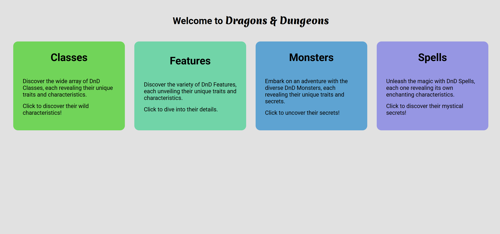

# Hi Everyone!!

## Here is a small project that I have done using some public API

### Project Description:

---

This project brings you a handy **_Dragons & Dungeons_** platform that renders limited information on various aspects such as **classes**, **features**, **monsters** and **spells**. The platform utilizes a public API making it super easy to use and seamlessly deliver information to the users.

### Public API used:

---

https://www.dnd5eapi.co/api/2014

### Steps to run the project:

---

Step 1: Download the code

Step 2: run "npm i" or "npm install"

Step 3: run "node index.js" or "nodemon index.js"

#### P.S. [nodemon](https://www.npmjs.com/package/nodemon) is a utility tool (NPM package) to assist [Node.js](https://nodejs.org/) applications by automaticlaly restarting the application whenever there is a file change detected.

-   To install nodemon globally, run "npm install -g nodemon" in the terminal.

---

### Project Home Page Screenshot:

---

<!--  -->

